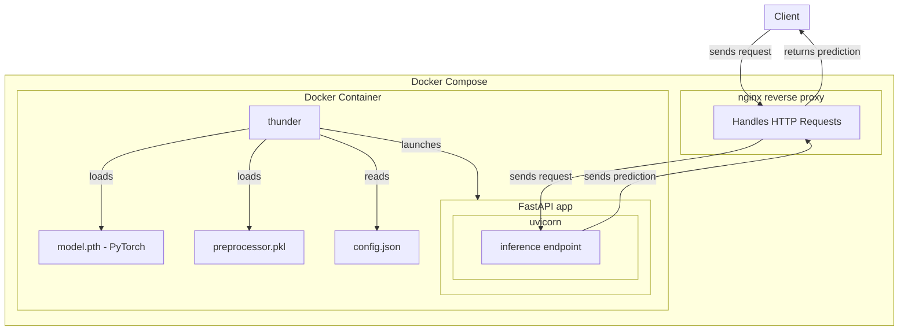

# `manual`

## `python -m thunder serve`  

### `/`

```
curl -X GET  http://127.0.0.1:8000/
```

### `/predict`

```
curl -X POST http://127.0.0.1:8000/predict -H "Content-Type: application/json" \-d @data.json
```

## `python -m thunder chunk`

```
python -m thunder chunk --input climate-data.csv --size 500
```

## `configuration file`

```python
{
  "training_config": {
    "epochs": 10
  },
  "preprocessor_path": "preprocessor/preprocessor-12-16-2024.pkl",
  "model_path": "model/model-12-16-2024.pth",
  "model_config": {
    "num_features": 1,
    "hidden_size": 64,
    "num_layers": 2,
    "future_steps": 12,
    "learning_rate": 0.001,
    "dropout": 0.2,
    "num_attention_heads": 4
  },
  "preprocessing_config": {
    "numerical_features": [],
    "target_variables": ["meantemp"],
    "use_target_as_feature": true,
    "split_config": {
      "past_steps": 24,
      "future_steps": 12,
      "train_ratio": 0.7,
      "val_ratio": 0.15,
      "batch_size": 32
    }
}
}
```

## `compose`

`docker-compose up --build`

